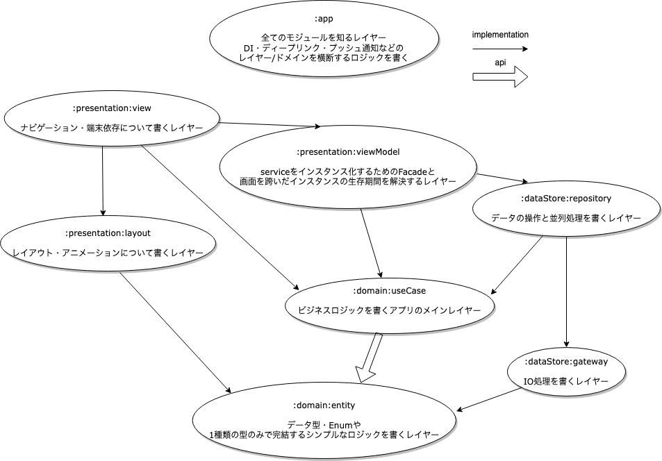

# アーキテクチャ構成図

## 管理方法
- 新しいライブラリが出るとDependabotがプルリクエストを作ってくれる
- 社内Slackチャンネルの[android_template_notification]に通知が行くのでマージ処理を行う

## 使い方
1. Github上でこのレポジトリを複製する
2. プロジェクト設定の値を修正する => [プロジェクト設定](./buildSrc/src/main/kotlin/ProjectProperty.kt)、[モジュール設定](./buildSrc/src/main/kotlin/ModuleStructure.kt)
3. Gitサブモジュールを有効化する

## モジュール自動生成機能の使い方
1. ModuleStructureにスネークケースでモジュール名を追加
2. gradle syncを「2回」実行
3. モジュールとテンプレートクラスが自動生成され、モジュール名の階層に応じてモジュール間の依存関係が自動で組まれる
4. https://www.youtube.com/watch?v=i0QfRQx1IIQ

### モジュール間の依存関係自動生成のルール例

- auth
- auth_login
- auth_login_sns
- auth_login_sns_facebook
- auth_login_sns_twitter
- auth_login_sns_core
- auth_core

のように作った場合、
- authは「auth_~」で始まる全てのモジュール
- auth_loginは「auth_login_~」で始まる全てのモジュールとauth_core
- auth_login_snsは「auth_login_sns_~」で始まる全てのモジュールとauth_core
- auth_login_sns_facebookはauth_login_sns_coreとauth_core
- auth_login_sns_twitterはauth_login_sns_coreとauth_core
を参照できるようになっています。

## ドメイン一覧
- core => ドメイン間で共通で使うコードを書く
- auth => 認証に関するロジックを書く

## 関連ドキュメントへのリンク一覧

